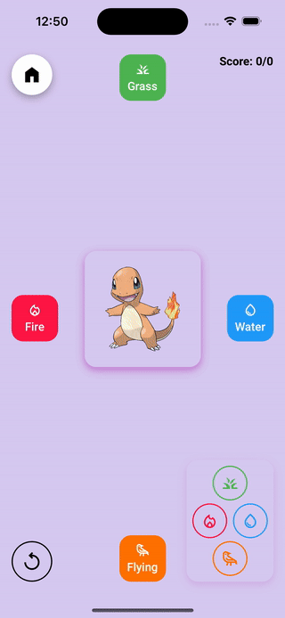

# React Native Swipeable Card Stack

Implement a swipeable card stack, similar to Tinder, with ease.

This library is based on [react-native-reanimated](https://github.com/software-mansion/react-native-reanimated) and on [react-native-gesture-handler](https://github.com/software-mansion/react-native-gesture-handler).

<!-- prettier-ignore -->
| 😼 | 🔥 |
| - | - |
|  |  |

## Features

- ✅ support swipes to the left, right, top, and bottom
- ✅ support unswipes
- ✅ support preventing card translation along any direction
- ✅ support customizing swipe and unswipe animations
- ✅ support customizing the criteria for which a card is swiped
- ✅ allow performing your own animations on the cards based on the swipe/unswipe progression

## Example

```typescript
type CatItem = {
  name: string
  age: number
}

const cats: CatItem[] = [
  { name: 'Felix', age: 6 },
  { name: 'Lily', age: 3 },
  { name: 'Diego', age: 2 },
]

export const CatStack = () => {
  const ref = useRef<SwipeableCardStackRef>(null)

  return (
    <>
      <SwipeableCardStack
        data={cats}
        renderCard={CatCard}
        lockedDirections={['top', 'bottom']}
        ref={ref}
      />
      <Button
        title="Swipe left"
        onPress={() => {
          ref.current?.swipe('left')
        }}
      />
      <Button
        title="Unswipe"
        onPress={() => {
          ref.current?.unswipe()
        }}
      />
      <Button
        title="Swipe right"
        onPress={() => {
          ref.current?.swipe('right')
        }}
      />
    </>
  )
}

const CatCard = ({
  name,
  age,
  xAnimationPosition,
}: RenderCardProps<CatItem>) => {
  const cardAnimatedStyle = useAnimatedStyle(() => ({
    backgroundColor: interpolateColor(
      xAnimationPosition.value,
      [-1, 0, 1],
      ['#F44336', 'white', '#43A047'],
    ),
  }))

  return (
    <Animated.View
      style={[
        {
          flex: 1,
          justifyContent: 'center',
          alignItems: 'center',
        },
        cardAnimatedStyle,
      ]}
    >
      <Text>{`${name} - ${age}`}</Text>
    </Animated.View>
  )
}
```

To see two more complete examples, check out the [example app](./example-app/).

## Installation

First, follow [react-native-reanimated](https://docs.swmansion.com/react-native-reanimated/docs/fundamentals/getting-started/) and [react-native-gesture-handler](https://docs.swmansion.com/react-native-gesture-handler/docs/fundamentals/installation/) installation guides.

Then install the library through npm:

### Expo

```sh
expo install react-native-swipeable-card-stack
```

### Bare React Native

```sh
yarn add react-native-swipeable-card-stack
```

## Documentation

This library exposes a `SwipeableCardStack` component that displays the cards, reacts to user gestures, performs some animations and send swipping events.

Here is the list of props this component accepts. Only `data` and `renderCard` are mandatory.

### `SwipeableCardStack`'s props

#### ▶️ data

> `T[]`

An array of data items that will be passed to `renderCard`.

#### ▶️ renderCard

> `(params: RenderCardProps<T>) => ReactNode`

A function that renders a card based on the provided data and additional props. (see [renderCard's additional props](#rendercards-additional-props)).

#### ▶️ cardWrapperStyle

> `StyleProp<ViewStyle>`

An optional `ViewStyle` that will be applied to the wrapper component of every card.

Default value: `undefined`.

#### ▶️ onActiveCardUpdate

> `(swipeUpdate: SwipeUpdate<T>) => void`

An optional function that will be triggered everytime a swipe update occurs.

This is where you should listen for important updates such as a validated swipe.

Default value: `undefined`.

#### ▶️ numberOfRenderedCards

> `number`

How many cards should be rendered at the same time.

To improve performance, _react-native-swipeable-card-stack_ does not render all the cards. This has usually no visual impact from a user standpoint because most of the cards are hidden by the two first cards of the stack. However, if you encounter a case where some cards are not visible, you may want to increase this value.

Default value: `3`.

#### ▶️ endedSwipePosition

> `SwipeAxisDependentProp<number>`

The position where the cards rest at the end of a swipe.

This prop accepts either a number or an object whose keys are swipe axis ("x" and "y") and whose values are numbers.

For example, if you set `endedSwipePosition` to 400, a card swiped respectively to the left or to the bottom will end its movement at respectively +400 to the left or +400 to the bottom. A card swiped respectively to the right or to the top will end its movement at respectively +400 to the right or +400 to the top.

Before any swipe, the cards sit idle at the position 0.

Default value: `{ x: 1.5 * screenWidth, y: 1 * screenHeight }`.

#### ▶️ validateSwipeTranslationThreshold

> `SwipeAxisDependentProp<number>`

The translation needed for a swipe to be considered as validated, which means that if the user releases the card, the swipe animation will finish and the swipe will be completed.

This prop accepts either a number or an object whose keys are swipe axis ("x" and "y") and whose values are numbers.

For example, if you set `validatedSwipeTranslationThreshold` to 200 and the user swipes 190 to the right and releases the card, the swipe will be aborted. Hovewer, if the user swipes 210 to the right, the swipe will complete.

A swipe can also be validated if the velocity is high enough, see `validateSwipeVelocityThreshold`.

Default value: `{ x: 0.5 * screenWidth, y: 0.25 * screenHeight }`.

#### ▶️ validateSwipeVelocityThreshold

> `SwipeAxisDependentProp<number>`

The velocity needed for a swipe to be validated.

This prop accepts either a number or an object whose keys are swipe axis ("x" and "y") and whose values are numbers.

A swipe can also be validated if the translation is high enough, see `validateSwipeTranslationThreshold`.

Default value: `800`.

#### ▶️ validatedSwipeAnimationConfig

> `SwipeAxisDependentProp<(payload: PanGestureHandlerEventPayload) => WithSpringConfig>`

A function that returns a reanimated [SpringConfig](https://docs.swmansion.com/react-native-reanimated/docs/animations/withSpring/) that will be used in the final animation once a swipe is validated.

This prop can also accept an object whose keys are swipe axis ("x" and "y") and whose values are functions that return a reanimated [SpringConfig](https://docs.swmansion.com/react-native-reanimated/docs/animations/withSpring/).

`payload` is a gesture-handler payload that you can use to customize the config.

Default value: `{ x: ({ velocityX }) => ({ velocity: 0.0001 * velocityX, mass: 1, damping: 100, stiffness: 200 }), y: ({ velocityY }) => ({ velocity: 0.0001 * velocityY, mass: 1, damping: 100, stiffness: 200 }) }`.

#### ▶️ imperativeSwipeAnimationConfig

> `SwipeAxisDependentProp<WithTimingConfig | undefined>`

A reanimated [TimingConfig](https://docs.swmansion.com/react-native-reanimated/docs/animations/withTiming) that is used when the card is imperatively swiped via `ref.swipe`.

This prop can also accept an object whose keys are swipe axis ("x" and "y") and whose values are reanimated [TimingConfig](https://docs.swmansion.com/react-native-reanimated/docs/animations/withTiming).

Default value: `{ duration: 300, easing: Easing.inOut(Easing.quad) }`.

#### ▶️ stoppedSwipeAnimationConfig

> `SwipeAxisDependentProp<WithTimingConfig | undefined>`

A reanimated [TimingConfig](https://docs.swmansion.com/react-native-reanimated/docs/animations/withTiming) that is used when the swipe is stopped without being validated and the card position gets reset.

This prop can also accept an object whose keys are swipe axis ("x" and "y") and whose values are reanimated [TimingConfig](https://docs.swmansion.com/react-native-reanimated/docs/animations/withTiming).

Default value: `{ duration: 300, easing: Easing.inOut(Easing.quad) }`.

#### ▶️ unswipeAnimationConfig

> `SwipeAxisDependentProp<WithTimingConfig | undefined>`

A reanimated [TimingConfig](https://docs.swmansion.com/react-native-reanimated/docs/animations/withTiming) that is used when an unswipe (undoing of a swipe) is performed.

This prop can also accept an object whose keys are swipe axis ("x" and "y") and whose values are reanimated [TimingConfig](https://docs.swmansion.com/react-native-reanimated/docs/animations/withTiming).

Default value: `{ duration: 300, easing: Easing.inOut(Easing.quad) }`.

#### ▶️ lockedDirections

> `SwipeDirection[]`

An array of directions ("left", "right", "top" or "bottom") in which cards cannot be moved.

For example, if you want to only allow horizontal swipes, you should set `lockedDirections` to `["top", "bottom"]`.

Defaut value: `[]`.

### `renderCard`'s additional props

#### ▶️ index

> `number`

The index of the card in the stack.

#### ▶️ status

> `CardStatus`

Whether the card has been `swiped`, is the `current` one or is `unswiped` (and not the current one).

#### ▶️ xAnimationPosition

> `SharedValue<number>`

A reanimated [SharedValue](https://docs.swmansion.com/react-native-reanimated/docs/core/useSharedValue/) that is synced with the swipe x position of the current card and can be used to perform custom animations.

The value runs between -1 (the card is totally swiped to the left) and 1 (the card is totally swiped to the right).

A value of 0 means the card is at its resting x position.

#### ▶️ yAnimationPosition

> `SharedValue<number>`

A reanimated [SharedValue](https://docs.swmansion.com/react-native-reanimated/docs/core/useSharedValue/) that is synced with the swipe y position of the current card and can be used to perform custom animations.

The value runs between -1 (the card is totally swiped to the top) and 1 (the card is totally swiped to the bottom).

A value of 0 means the card is at its resting y position.

### SwipeableCardStack's ref

If you declare a ref and pass it to `SwipeableCardStack` you can imperatively call these functions:

#### ▶️ swipe

> `(direction: SwipeDirection) => void`

Imperatively swipe the current card to the provided direction.
The direction can either be 'left', 'right', 'top' or 'bottom'.

#### ▶️ unswipe

> `() => void`

Imperatively undo the last swipe.

## Contributing

See [CONTRIBUTING.md](./CONTRIBUTING.md).
